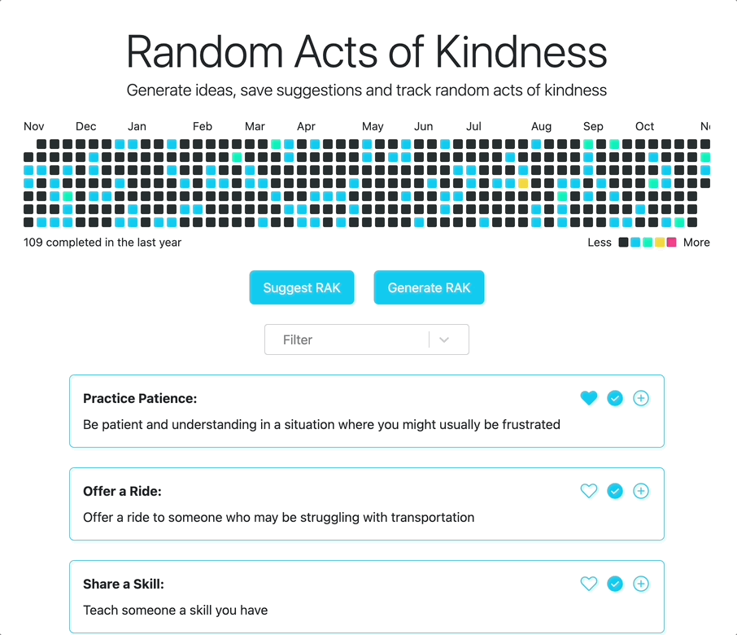

# Random Acts of Kindness

Suggesting simple acts of kindness to encourage and spread positivity.

Built using Ruby on Rails with React

- Save and mark acts completed and track your progress
- Generate new RAK suggestions using OpenAI



## Development

This code requires Ruby to run.

[Install Ruby](https://www.ruby-lang.org/en/documentation/installation/), if you don't already have it installed:

```

brew install rbenv ruby-build
rbenv install 3.2.0
gem install bundler

```

Install project dependencies:

```
bundle install
```

Create and seed the database:

```
rails db:create
rails db:seed
```

Run the server:

```
rails s
```

Run tests:

```
rails test
```
